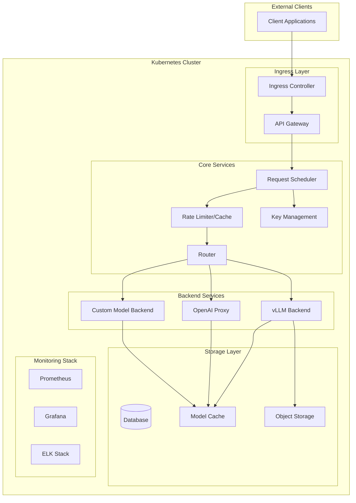

```mermaid
graph TB
    subgraph "External Clients"
        C[Client Applications]
    end

    subgraph "Kubernetes Cluster"
        subgraph "Ingress Layer"
            IG[Ingress Controller]
            AG[API Gateway]
        end
        
        subgraph "Core Services"
            RS[Request Scheduler]
            RC[Rate Limiter/Cache]
            KM[Key Management]
            RT[Router]
        end
        
        subgraph "Backend Services"
            B1[vLLM Backend]
            B2[OpenAI Proxy]
            B3[Custom Model Backend]
        end
        
        subgraph "Storage Layer"
            DB[(Database)]
            MC[Model Cache]
            S3[Object Storage]
        end
        
        subgraph "Monitoring Stack"
            P[Prometheus]
            G[Grafana]
            ELK[ELK Stack]
        end
    end

    C --> IG
    IG --> AG
    AG --> RS
    RS --> RC
    RS --> KM
    RC --> RT
    RT --> B1
    RT --> B2
    RT --> B3
    B1 --> MC
    B1 --> S3
    B2 --> MC
    B3 --> MC
```
