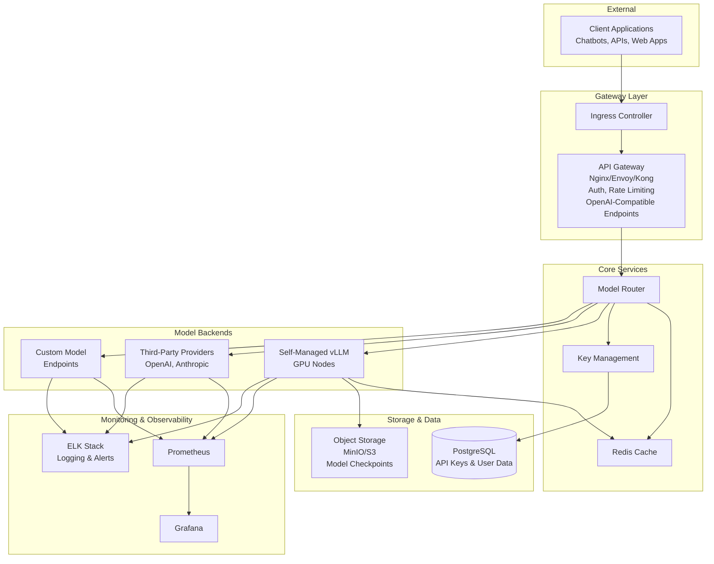

```mermaid
graph TB
    subgraph "External"
        C[Client Applications<br/>Chatbots, APIs, Web Apps]
    end

    subgraph "Gateway Layer"
        IG[Ingress Controller]
        AG[API Gateway<br/>Nginx/Envoy/Kong<br/>Auth, Rate Limiting<br/>OpenAI-Compatible Endpoints]
    end
    
    subgraph "Core Services"
        MR[Model Router]
        RC[Redis Cache]
        KM[Key Management]
    end
    
    subgraph "Model Backends"
        B1[Self-Managed vLLM<br/>GPU Nodes]
        B2[Third-Party Providers<br/>OpenAI, Anthropic]
        B3[Custom Model<br/>Endpoints]
    end
    
    subgraph "Storage & Data"
        DB[(PostgreSQL<br/>API Keys & User Data)]
        S3[Object Storage<br/>MinIO/S3<br/>Model Checkpoints]
    end
    
    subgraph "Monitoring & Observability"
        P[Prometheus]
        G[Grafana]
        ELK[ELK Stack<br/>Logging & Alerts]
    end

    %% Connections
    C --> IG
    IG --> AG
    AG --> MR
    MR --> RC
    MR --> KM
    
    %% Backend routing
    MR --> B1
    MR --> B2
    MR --> B3
    
    %% Storage connections
    B1 --> RC
    B1 --> S3
    KM --> DB
    
    %% Monitoring
    B1 & B2 & B3 --> P
    P --> G
    B1 & B2 & B3 --> ELK
```
